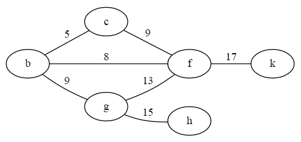
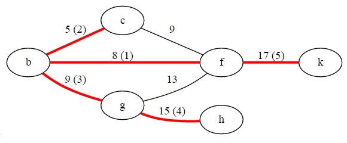

# Problem 84

Use [Prim's algorithm](http://www.tutorialspoint.com/data_structures_algorithms/prims_spanning_tree_algorithm.htm) to find the minimal spanning tree of a [connected](https://en.wikipedia.org/wiki/Connectivity_(graph_theory), [edge-weighted](http://mathworld.wolfram.com/WeightedGraph.html) graph. 

##Example
Example graph with weighted edges.




The minimum spanning tree, starting from f, and in the order of edges found by Prim's algorithm.



```elm
graph84 = ( [ 'b', 'c', 'd', 'f', 'g', 'h', 'k' ],
            [ ('b','c', 5), ('b','f', 8), ('b', 'g', 9), ('c', 'f', 9), ('f', 'g', 13), ('f','k', 17), ('g','h', 15) ] )

prim 'f' graph84 == ([ 'b', 'c', 'd', 'f', 'g', 'h', 'k' ], [('b','f',8),('b','c',5),('b','g',9),('g','h',15),('f','k',17)]) 
```
##Unit Test
```elm
import Html
import List
import Set


type alias Edge comparable =
    ( comparable, comparable, Int )


type alias AdjList comparable =
    List ( comparable, List comparable )


type alias Graph comparable =
    ( List comparable, List (Edge comparable) )


type alias SpanningTree comparable =
    ( Graph comparable, Graph comparable )


{- Given a starting node and a graph with weighted edges,
   return the minimum spanning tree in a graph
-}
prim : comparable -> Graph comparable -> Graph comparable
prim start ( nodes, edges ) =
    -- your implementation goes here
    ([], [])

main : Html.Html a
main =
    Html.text
        <| case test of
            0 ->
                "Your implementation passed all tests."

            1 ->
                "Your implementation failed one test."

            x ->
                "Your implementation failed " ++ (toString x) ++ " tests."


test : Int
test =
    List.length
        <| List.filter ((==) False)
            [ prim 'f' graph84 == prim84
            , prim 'f' loopsAndParallels == prim84
            ]

graph84 =
    ( [ 'b', 'c', 'd', 'f', 'g', 'h', 'k' ]
    , [ ( 'b', 'c', 5 )
      , ( 'b', 'f', 8 )
      , ( 'b', 'g', 9 )
      , ( 'c', 'f', 9 )
      , ( 'f', 'g', 13 )
      , ( 'f', 'k', 17 )
      , ( 'g', 'h', 15 )
      ]
    )
    

loopsAndParallels =
    ( [ 'b', 'c', 'd', 'f', 'g', 'h', 'k' ]
    , [ ( 'b', 'c', 5 )
      , ( 'b', 'f', 8 )
      , ( 'b', 'g', 9 )
      , ( 'c', 'f', 9 )
      , ( 'f', 'g', 13 )
      , ( 'f', 'k', 17 )
      , ( 'g', 'h', 15 )
      , ( 'c', 'c', 1000)
      , ( 'c', 'f', 1000) 
      ]
    )


prim84 = ( [ 'b', 'c', 'f', 'g', 'h', 'k' ]
         , [ ( 'b', 'f', 8 )
           , ( 'b', 'c', 5 )
           , ( 'b', 'g', 9 )
           , ( 'g', 'h', 15 )
           , ( 'f', 'k', 17 )
           ]
         )
```

##Solution
[Solution](../s/s84.md)